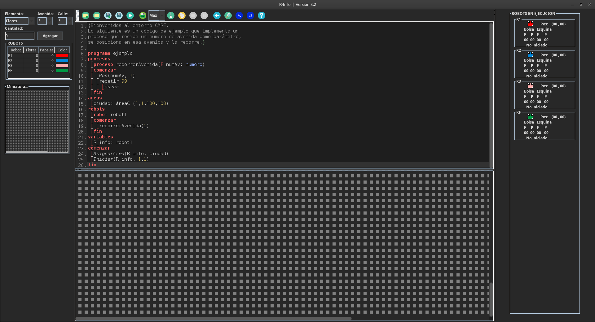
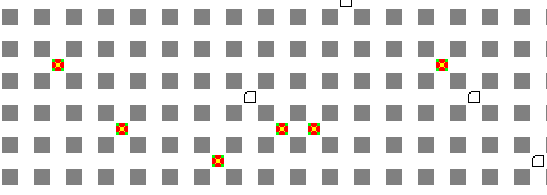
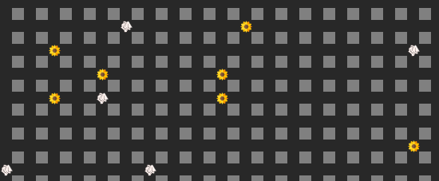

<h1 align="center">🌆 <b>rInfo 3.2</b></h1>

Esta es una versión modificada del entorno de programación **Rinfo**, originalmente desarrollado por la **UNLP**, con implementación de tema oscuro y otras mejoras visuales para una experiencia visual más cómoda a la vista.

---

## 🆕 Novedades y mejoras

-  **Modo oscuro** en toda la interfaz.
-  **Nuevo icono de acceso** a la aplicación.  
-  **Nuevos íconos en la paleta de herramientas** siguiendo Material Design.
-  **Efecto hover en los iconos de la paleta de herramientas**
-  **Ajuste de colores de fuente** para mejorar la legibilidad.  
-  **Revisión de la paleta de colores** en menús, botones y fondos.
-  **Nueva barra de desplazamiento** acorde al diseño.
-  **Nuevos iconos en la matriz de los robots** con mejor resolución.  
-  **Correcciones menores de estilo y alineación**.  

---

## Vista previa
Antes:

Con esta actualización:

  
##

Antes: 
  

Con esta actualización: 
  

##

Antes:  
  

Con esta actualización: 
  

---

## Instalación
1. Cloná este repositorio o descargá el `.jar` modificado.  
2. Asegurate de tener **Java** instalado [**en su versión mas reciente**](https://www.oracle.com/java/technologies/downloads/), si usas una versión inferior a la 21, **no va a funcionar**
3. Ejecutá el archivo `.jar` igual que la versión original de Rinfo.

---

## 💡 Créditos
- **Desarrollador original:** Facultad de Informática – UNLP  
- **Modificaciones visuales (modo oscuro, íconos y colores):** [juandidb](https://github.com/juandidb)

---

## 🧩 Estado del proyecto
Proyecto sin fines oficiales ni de lucro, creado únicamente con fines estéticos y experimentales.

---

## ⚠️  Errores comunes
- **Error: A JNI error has ocurred, please check your installation and try again:** Este error ocurre por tener instalada una versión antigua de JAVA, asegurate de tener JAVA actualizado a la versión 21 o posterior [descargandolo desde acá](https://www.oracle.com/java/technologies/downloads/)

---

> Esta versión **no es oficial**. Todos los cambios fueron realizados con asistencia de ia, respetando la estructura y funcionamiento original del entorno.

## ☕ Apoyá el proyecto

Si te gustó **rInfo 3.2** podés invitarme un café :)

